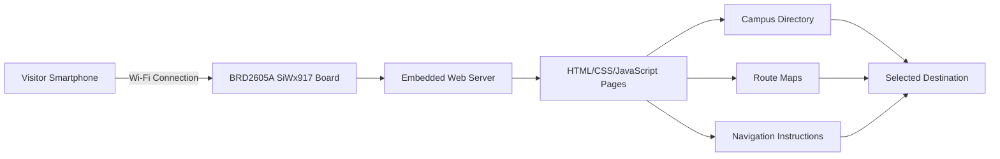

# BLU-PATH: Embedded Web-Based Indoor Navigation System

## 1. Project Overview

BLU-PATH is an embedded web-based indoor navigation system developed using the Silicon Labs BRD2605A (SiWx917) development board. The system creates a local Wi-Fi Access Point and hosts an embedded web server that provides navigation assistance within a campus environment.

Visitors can scan a QR code or connect directly to the BLU-PATH Wi-Fi network to access a browser-based navigation portal. The portal helps users locate facilities such as libraries, departments, laboratories, offices, and auditoriums without requiring internet access or a dedicated mobile application.

### Problem Statement

Visitors entering large campuses often face difficulties locating specific facilities. Traditional GPS-based navigation systems can identify the campus location but cannot provide accurate indoor or campus-level guidance, leading to confusion, delays, and dependency on staff assistance.

### Proposed Solution

BLU-PATH provides a self-contained navigation platform where route information, maps, and destination details are hosted directly on the embedded device. Users simply connect to the local network and access the navigation webpage through their smartphone browser.

---

## 2. Technical Architecture

### System Workflow

1. BRD2605A starts as a Wi-Fi Access Point.
2. User scans a QR code or connects to the BLU-PATH network.
3. The embedded web page opens in the browser.
4. User selects the desired destination.
5. The system displays navigation information and route guidance.
6. User follows the displayed directions to reach the destination.

---

## 3. Technologies Used

### Wireless Technologies

* Wi-Fi Access Point Mode
* Embedded HTTP Web Server

### Programming Languages

* C
* HTML
* CSS
* JavaScript

### SDKs and Frameworks

* WiseConnect SDK
* Silicon Labs Software Development Kit (SDK)

### Development Tools

* Simplicity Studio
* GitHub

---

## 4. Hardware Components

### Silicon Labs Hardware

* BRD2605A Development Board (SiWx917)

### External Hardware

* Smartphone / Tablet
* USB Power Supply
* QR Code Display Board

---

## 5. Software Components / Dependencies

### Silicon Labs Dependencies

* WiseConnect SDK
* Simplicity Studio
* Wi-Fi Driver Stack
* Embedded HTTP Server Library

### Web Technologies

* HTML
* CSS
* JavaScript

---

## 6. Key Features

* QR Code-Based Access
* Browser-Based Navigation
* Embedded Web Server Hosting
* Campus Directory Navigation
* No Mobile Application Required
* Internet-Free Operation
* Low-Cost Deployment
* Easy Scalability for Multiple Locations

---

## 7. Expected Outcome

BLU-PATH enables visitors, students, and staff to navigate campus facilities independently using only a smartphone browser. The system operates entirely on the BRD2605A platform, eliminating the need for internet connectivity while providing a reliable and user-friendly indoor navigation experience.

Potential deployment areas include:

* Educational Institutions
* Corporate Campuses
* Hospitals
* Industrial Facilities
* Public Buildings

---

## 8. Licensing

This project is developed for the Silicon Labs Centre of Innovation in IoT Program.

---

## 9. Maintainers / Contacts

* Jerlin Jeba MJ  -  mjjerlin@gmail.com
* Ilakkiya V      -  ilakkiya.v.2006@gmail.com
* Kanishka M      -  kanishkamuthukumar16@gmail.com
* Riyash M        -  riyashmoorthy@gmail.com
* Ramprasath V    -  veluramprasath777@gmail.com

---

